# Kalshi Betting Assistant Dashboard

## Enhancement Summary

**Deepened on:** 2026-05-25
**Review agents used:** Architecture Strategist, Performance Oracle, Python Reviewer, TypeScript Reviewer, Frontend Race Conditions Reviewer, Code Simplicity Reviewer, Security Sentinel, Data Integrity Guardian, Agent-Native Reviewer, Frontend Design Patterns, Pattern Recognition Specialist, Framework Docs Researcher

### Critical Fixes (Do Before Writing Code)

1. **SQLite PRAGMA foreign_keys = ON** — SQLite does NOT enforce FKs by default. Without this, every FK in the schema is decorative. One-line fix on connection.
2. **SQLite WAL mode + busy_timeout** — Without WAL, concurrent async writes produce SQLITE_BUSY errors. Set `journal_mode=WAL`, `busy_timeout=5000`, `synchronous=NORMAL` on every connection.
3. **Integer cents for all money** — Store prices as integer cents (1-99), not Decimal/float. Floating-point accumulation errors are insidious in P&L calculations. V1 and V2 both use cents internally.
4. **UNIQUE(kalshi_order_id) on BET** — Prevents double-counting P&L from duplicate records.
5. **UNIQUE(external_id) on GAME** — Prevents duplicate game records during ingestion.
6. **Create .gitignore immediately** — `.env`, `*.pem`, `*.db`, `data/`, `__pycache__/`, `.venv/`, `node_modules/`. Before any `.env` file exists.
7. **RiskManager class** — Hard-coded limits between API route and Kalshi: max contracts per order, max capital per market, daily loss limit, orders-per-minute cap, kill switch. Quick-execute skips the UI confirmation, NOT the programmatic safety checks.
8. **Client order ID (UUID)** for every order — Kalshi supports `client_order_id` for idempotency. V1 already uses this. Prevents double-submissions.

### Schema Changes

1. **Drop SPORT table** — Use a `sport: str` column on relevant tables. Only two sports (soccer, NFL). A full table with FK chains is over-engineered.
2. **Drop ALERT table** — High-confidence suggestions play a sound. No separate alert entity needed for MVP.
3. **CHAT_MESSAGE table deferred to Phase 4** — hold chat in memory until AI partner ships. Core value is Layer 1+2.
4. **Collapse BET.status + BET.lifecycle** — They overlap (`closed_early` and `hedged` in both). Keep `status` (open, won, lost, cancelled). Add `exit_type` (held_to_settlement, closed_early, hedged, partial_close) — only set when status hits terminal state.
5. **Add `UNIQUE(market_id, side)` on POSITION** — Prevents duplicate position records from concurrent sync.
6. **Add NOT NULL constraints** — `BET.side`, `BET.quantity`, `BET.entry_price_cents`, `BET.status`, `POSITION.side`, `POSITION.quantity`.
7. **Add `kalshi_fill_id UK` on BET** — Unique per fill, prevents duplicate BET creation during position reconciliation sync cycles.
8. **Extract GAME.home_score, away_score, minute, period** from `live_state` JSON into proper columns for indexing.
9. **Add `parent_bet_id FK (nullable)` to BET** — Links hedge bets to their parent.
10. **Add `suggestion_group_id` to SUGGESTION** — Groups multi-leg parlay suggestions (schema-ready, frontend deferred).

### Architecture Changes

1. **Rename `BET.direction` to `BET.side`** — Matches V1, V2, and Kalshi's own API vocabulary.
2. **Rename `conviction` to `confidence` everywhere** — One term, not two, for the same concept.
3. **Add `core/exceptions.py`** — Port V1's `OrderError` taxonomy (POST_ONLY_REJECTED, INSUFFICIENT_BALANCE, MARKET_HALTED, RATE_LIMITED) as Python exceptions.
4. **Add `core/logging.py`** — Structured key-value logging (V2's pattern).
5. **Add `services/` layer** — `bet_service.py` between routes and `order_manager.py`. The order manager handles Kalshi lifecycle; the bet service handles DB persistence, tagging, and events.
6. **Define `ChatContext` dataclass** — Explicit context assembled before every LLM call: bankroll, positions, exposure, live games, markets, suggestions, news, odds comparison, pattern insights, chat history.
7. **Define system prompt structure** — Identity, sport-specific knowledge (from `sports/soccer.py`), strategy framework, current state (injected at runtime), behavioral rules.
8. **Demo/production as env-var only** — NOT a UI toggle. Requires process restart to switch. Display persistent "PRODUCTION" banner.
9. **Hardcode `127.0.0.1` binding** — Localhost IS the authentication mechanism. Do not allow override to `0.0.0.0`.
10. **CORS origin whitelist** — Exactly `http://localhost:5173`, not `*`.
11. **Use one LLM model (Sonnet) for MVP** — Skip tiered routing complexity. Optimize later.

### Frontend Changes

1. **Remove `tailwind.config.ts`** — Tailwind v4 uses CSS-first `@theme` in `theme.css`.
2. **WebSocket as React context provider** — Not a hook. Single connection guarantee.
3. **WS events update TanStack cache via `setQueryData`** — Not `invalidateQueries`. Hot data should never trigger re-fetches.
4. **OrderPanel displaces chat sidebar** — Not a modal or overlay. Chat collapses to icon strip. Main content (game state, markets) always visible during order creation.
5. **Kill AlertSound.tsx component** — Use `lib/sounds.ts` as a plain utility.
6. **Three-color semantic system** — Green (money gained), Red (money lost), Amber/Gold (money proposed/action). Never red for alerts or suggestions.
7. **Skeleton loading states** — Not spinners. Skeletons maintain spatial layout.
8. **`font-mono tabular-nums` for all monetary values** — Prices, probabilities, P&L, quantities, Kelly fractions.
9. **Don't add Zustand** — TanStack Query + `useState`/`useReducer` is sufficient for a single-user app.

### Race Conditions to Design For

1. **Stale price on confirm** — Price drift guard: if market moved >2c since staging, show warning before confirming.
2. **WS reconnection gap** — Snapshot-then-subscribe with sequence fencing on reconnect.
3. **Double-click confirm** — State machine: idle → staging → confirming → done. `confirming` disables the button.
4. **Overlapping chat responses** — Abort previous request when new message sent.

### Deferred to Post-MVP

- **Pattern detection** (`strategy/patterns.py`) — needs 20+ bets, irrelevant at launch
- **News aggregation** (`ingestion/news.py`) — manually paste news into chat for now
- **Manual bet entry** — add when ledger has enough system bets to compare against
- **Calendar heatmap** / **Equity curve** charts — add after a month of data
- **Proactive agent-initiated chat messages** — suggestions surface on dashboard for now
- **Calibration tracking** (AI probability vs. actual outcomes) — add after enough settled bets
- **Post-mortem on settlement** — LLM reviews after bet settles, add after MVP
- **Batch staging for parlays** (`suggestion_group_id` frontend) — schema-ready, no UI yet
- **Position correlation warning** — "You have X% exposure to Brazil"
- **Demo mode UI toggle** — env-var only, requires restart
- **Responsive mobile layout** — ship for one viewport (your monitor)
- **Branded types** (`Cents`, `Contracts`) — Python doesn't enforce at runtime, use StrEnums + convention

---

## Overview

A sports betting workbook with an AI brain. Three independent value layers:

1. **Workstation** — Better Kalshi frontend. See markets, place bets, manage positions. Value day one with zero AI.
2. **Logbook** — Every bet logged with who proposed it, reasoning, tags, outcome. Builds a dataset for learning.
3. **AI Partner** — Proactive suggestions, pattern recognition, Kelly sizing, collaborative decisions.

Each layer is independently useful. The app is organized into sport portals (same template, different content). Soccer (World Cup) ships first, NFL slots in later. Target: **June 14, 2026** (World Cup opener).

(See brainstorm: `docs/brainstorms/2026-05-24-kalshi-betting-assistant-brainstorm.md`)

## Technical Approach

### Architecture

**Monolith**: Python 3.12 / FastAPI backend + React 19 / TypeScript frontend. SQLite via SQLAlchemy async. Single process.

Reuse from prior projects:
- **From V2** (`Kalshi-Mean-Reversion-Bot`): RSA-PSS auth (`core/auth.py`), token bucket rate limiter, httpx async client pattern, SQLAlchemy models, Alembic migrations, supervisor/task orchestration, Kelly sizing (`paper_trader/kelly.py`), config pattern (Pydantic Settings)
- **From V1** (`Kalshi-Bot`): Full Kalshi REST order management (place/cancel/amend/get positions/fills), WebSocket wire format parsing (all 6 message types), order error taxonomy, ESPN-to-Kalshi team matching logic, dashboard visual design (dark theme, ops-card pattern, session cards)

### Stack

| Layer | Technology |
|-------|-----------|
| Backend | Python 3.12, FastAPI, uvicorn |
| Database | SQLite + SQLAlchemy async + Alembic |
| Real-time | WebSocket (FastAPI native) — backend-to-frontend push |
| HTTP client | httpx (async) for Kalshi REST, API-Football, Odds API |
| LLM | Anthropic SDK (Python) — Sonnet for everything (MVP, skip tiered routing) |
| Frontend | React 19, TypeScript, React Router 7, TanStack Query 5 |
| Styling | Tailwind CSS v4 with V1's dark theme color system |
| Charts | Recharts (P&L, trends) + Lightweight Charts (equity curve) |
| Package mgmt | uv (backend), npm (frontend) |
| Testing | pytest + pytest-asyncio (backend), Vitest (frontend) |

### File Structure

```
kalshibot3/
├── .gitignore                        # FIRST FILE: .env, *.pem, *.db, data/, __pycache__/, .venv/, node_modules/
├── CLAUDE.md
├── .env.example
├── start.sh                          # Single-instance startup (lesson from V1)
│
├── backend/
│   ├── pyproject.toml
│   ├── alembic.ini
│   ├── alembic/
│   │   └── versions/
│   │
│   ├── src/
│   │   ├── main.py                   # FastAPI app, lifespan, WS endpoint
│   │   ├── config.py                 # Pydantic Settings, .env loading
│   │   │
│   │   ├── core/
│   │   │   ├── auth.py               # Kalshi RSA-PSS (port from V2), PEM permission check
│   │   │   ├── db.py                 # SQLAlchemy engine, session factory, SQLite pragmas
│   │   │   ├── ws_manager.py         # WebSocket connection manager (browser clients), 500ms coalescing
│   │   │   ├── types.py              # StrEnum definitions, branded types (Cents, Contracts)
│   │   │   ├── exceptions.py         # BotError → KalshiError, IngestionError, StrategyError
│   │   │   └── logging.py            # Structured key-value logging
│   │   │
│   │   ├── models/
│   │   │   ├── bet.py                # Bet ledger (integer cents, NOT NULL on core fields, UNIQUE kalshi_order_id)
│   │   │   ├── position.py           # Open positions (UNIQUE market_id+direction)
│   │   │   ├── suggestion.py         # AI suggestions (with suggestion_group_id for parlays)
│   │   │   ├── market.py             # Kalshi market snapshots (UNIQUE kalshi_ticker)
│   │   │   ├── game.py               # Live game state (UNIQUE external_id, extracted score/minute columns)
│   │   │   └── chat.py               # Chat message history (defer to Phase 4)
│   │   │
│   │   ├── kalshi/
│   │   │   ├── rest.py               # Full REST client + token bucket rate limiter
│   │   │   ├── ws.py                 # WebSocket client (orderbook, fills, reconnect with sequence tracking)
│   │   │   ├── schemas.py            # Wire format parsing (dollar→cents at boundary, ONLY here)
│   │   │   └── order_manager.py      # Order lifecycle only (emits typed events, no DB writes)
│   │   │
│   │   ├── services/
│   │   │   ├── bet_service.py        # BET record creation, auto-tagging, DB persistence
│   │   │   └── risk_manager.py       # Hard limits: max order, daily loss, kill switch
│   │   │
│   │   ├── ingestion/
│   │   │   ├── api_football.py       # API-Football poller (live scores, events, lineups)
│   │   │   └── odds_api.py           # The Odds API poller (odds from multiple books)
│   │   │
│   │   ├── sports/
│   │   │   ├── base.py               # Sport base class — the "wrapper"
│   │   │   ├── soccer.py             # Soccer-specific: event types, markets, strategy hints
│   │   │   └── nfl.py                # NFL-specific (future)
│   │   │
│   │   ├── strategy/
│   │   │   ├── kelly.py              # Kelly criterion sizing (port from V2)
│   │   │   ├── analyzer.py           # LLM-powered analysis at decision points
│   │   │   └── suggester.py          # Proactive bet suggestion engine
│   │   │
│   │   ├── api/
│   │   │   ├── routes/
│   │   │   │   ├── sports.py         # Sport portal data (news, suggestions, positions, history)
│   │   │   │   ├── bets.py           # Order placement, position management (Pydantic-validated inputs)
│   │   │   │   ├── chat.py           # Chat endpoint (assembles ChatContext, returns AgentResponse)
│   │   │   │   ├── ledger.py         # Bet history, filtering, analytics
│   │   │   │   └── health.py         # System status
│   │   │   └── ws.py                 # WebSocket endpoint for real-time push
│   │   │
│   │   └── supervisor.py             # Orchestrates all background tasks
│   │
│   └── tests/
│       ├── test_kalshi/              # Order lifecycle, position sync, wire format
│       ├── test_strategy/            # Kelly, suggestions, patterns
│       ├── test_api/                 # Route tests
│       └── conftest.py
│
├── dashboard/
│   ├── package.json
│   ├── vite.config.ts
│   │
│   ├── src/
│   │   ├── main.tsx
│   │   ├── App.tsx                   # Router setup, layout shell
│   │   │
│   │   ├── components/
│   │   │   ├── ui/                   # Primitives: Card, Badge (variant system), Button, Input, StatCard, Skeleton
│   │   │   ├── trading/              # OrderPanel, PositionCard, MarketRow, KellyDisplay
│   │   │   ├── chat/                 # ChatPanel (3-state), ChatMessage, SuggestionCard (amber accent)
│   │   │   └── charts/              # PnLChart, StrategyBreakdown
│   │   │
│   │   ├── pages/
│   │   │   ├── SportPortal.tsx       # The universal sport page (parameterized by sport)
│   │   │   ├── Dashboard.tsx         # Home/overview across all sports
│   │   │   ├── Ledger.tsx            # Full bet history with tag filtering
│   │   │   └── Settings.tsx          # Bankroll config, API keys, preferences
│   │   │
│   │   ├── contexts/
│   │   │   └── WebSocketProvider.tsx  # React context (not hook). Single connection. setQueryData on events.
│   │   │
│   │   ├── hooks/
│   │   │   ├── usePositions.ts       # TanStack Query (cold bootstrap, hot via WS context)
│   │   │   ├── useMarkets.ts         # TanStack Query for markets
│   │   │   ├── useLedger.ts          # TanStack Query for bet history
│   │   │   └── useChat.ts            # Chat state and message management
│   │   │
│   │   ├── lib/
│   │   │   ├── api.ts                # Typed API client
│   │   │   ├── format.ts             # Price/odds/date formatters
│   │   │   └── sounds.ts             # Alert sound management
│   │   │
│   │   └── styles/
│   │       └── theme.css             # Tailwind theme: V1's dark color system
│   │
│   └── public/
│       └── sounds/                   # Alert audio files
│
└── docs/
    ├── brainstorms/
    └── plans/
```

### Database Schema

Core tables: GAME, MARKET, BET, SUGGESTION, POSITION, CHAT_MESSAGE. SPORT and ALERT tables dropped for MVP (sport is a string column, alerts are high-urgency suggestions).

All monetary values stored as **integer cents** (not Decimal, not float). Dollar-to-cents conversion happens at the Kalshi wire boundary (`kalshi/schemas.py`) and nowhere else.

```mermaid
erDiagram
    GAME {
        int id PK
        string sport "soccer, nfl"
        string external_id UK "API-Football match ID"
        string home_team
        string away_team
        datetime kickoff
        string status "scheduled, live, finished"
        int home_score "extracted from live_state for indexing"
        int away_score "extracted from live_state for indexing"
        int minute "extracted from live_state for indexing"
        string period "1H, 2H, HT, ET, PEN"
        json live_state "full event list, volatile data"
        json metadata "venue, weather, lineups"
        datetime created_at
        datetime updated_at
    }

    MARKET {
        int id PK
        string sport
        int game_id FK "nullable for futures"
        string kalshi_ticker UK
        string market_type "match_result, total_goals, futures, etc."
        string title
        int yes_price_cents "1-99"
        int no_price_cents "1-99"
        int volume
        datetime close_time
        string status "open, closed, settled"
        string settlement "yes, no, null"
        datetime settlement_detected_at "nullable"
        datetime created_at
        datetime updated_at
    }

    SUGGESTION {
        int id PK
        string sport
        int market_id FK
        int suggestion_group_id "nullable — groups multi-leg parlays"
        string side "yes, no"
        int suggested_price_cents
        int suggested_size_cents
        int kelly_fraction_bps "basis points"
        int estimated_edge_bps "basis points"
        int ai_probability_pct "0-100"
        int market_probability_pct "0-100"
        string strategy "mean_reversion, lock_parlay, underdog, moon_parlay"
        text justification
        string confidence "high, medium, low"
        string urgency "high, medium, low"
        string status "pending, accepted, rejected, expired"
        text rejection_reason "nullable — why user passed"
        datetime created_at
        datetime acted_on_at
        datetime expires_at
    }

    BET {
        int id PK
        string sport
        int market_id FK
        int suggestion_id FK "nullable — user-initiated bets have no suggestion"
        int parent_bet_id FK "nullable — links hedge bets to parent"
        string kalshi_order_id UK "nullable for manual bets"
        string kalshi_fill_id UK "nullable — unique per fill for dedup during position reconciliation"
        string client_order_id UK "UUID for idempotency"
        string side "yes, no"
        int entry_price_cents "NOT NULL, 1-99"
        int exit_price_cents "nullable until closed"
        int quantity "NOT NULL"
        int stake_cents "NOT NULL"
        int pnl_cents "nullable until settled"
        string status "open, won, lost, cancelled"
        string exit_type "nullable — held_to_settlement, closed_early, hedged, partial_close"
        string source "human, ai, collaborative, external"
        string strategy "mean_reversion, lock_parlay, underdog, moon_parlay, manual"
        string confidence "high, medium, low"
        int kelly_fraction_bps
        int ai_probability_pct "AI estimate at time of bet"
        bool human_override_sizing
        bool human_override_direction
        text human_reasoning
        text ai_reasoning
        string timing "pre_match, live, futures"
        string game_period "nullable — 1H, 2H, etc."
        string game_clock "nullable — 45+3, 72, etc."
        json tags "flexible additional tags"
        bool verified "true for system bets, false for manual entry"
        int version "optimistic locking"
        datetime placed_at
        datetime settled_at
        datetime created_at
        datetime updated_at
    }

    POSITION {
        int id PK
        string sport
        string kalshi_ticker
        int market_id FK
        string side "NOT NULL"
        int quantity "NOT NULL"
        int avg_entry_price_cents "NOT NULL"
        int current_price_cents
        int unrealized_pnl_cents
        datetime last_synced
        datetime created_at
        datetime updated_at
    }

    CHAT_MESSAGE {
        int id PK
        string sport
        string role "user, assistant"
        text content
        json referenced_ids "suggestion_ids, bet_ids, market_ids"
        bool agent_initiated "false for user msgs, true for proactive AI"
        datetime created_at
    }

    GAME ||--o{ MARKET : has
    MARKET ||--o{ SUGGESTION : has
    MARKET ||--o{ BET : has
    MARKET ||--o{ POSITION : has
    SUGGESTION ||--o| BET : "may become"
    BET ||--o| BET : "hedge parent"
```



**Constraints enforced at DB level:**
- `UNIQUE(kalshi_order_id)` on BET (allows multiple NULLs for manual bets)
- `UNIQUE(kalshi_fill_id)` on BET (prevents duplicate BET creation during position reconciliation)
- `UNIQUE(client_order_id)` on BET
- `UNIQUE(external_id)` on GAME
- `UNIQUE(kalshi_ticker)` on MARKET
- `UNIQUE(market_id, side)` on POSITION (upsert via `INSERT ... ON CONFLICT UPDATE`)
- `CHECK(entry_price_cents >= 1 AND entry_price_cents <= 99)` on BET
- `CHECK(sport IN ('soccer', 'nfl'))` on GAME, MARKET, BET, SUGGESTION, POSITION
- `PRAGMA foreign_keys = ON` on every connection

**Indexes (non-unique, for hot query paths):**
- `BET(sport, status)` — ledger filtering
- `BET(market_id)` — position-to-bet lookup
- `BET(placed_at)` — chronological queries
- `SUGGESTION(sport, status)` — active suggestions per sport
- `GAME(sport, status, kickoff)` — live game lookup

### Research Insights: Architecture

**SQLite Configuration (CRITICAL — set on every connection):**
```python
from sqlalchemy import event

@event.listens_for(engine.sync_engine, "connect")
def set_sqlite_pragma(dbapi_connection, connection_record):
    cursor = dbapi_connection.cursor()
    cursor.execute("PRAGMA journal_mode=WAL")
    cursor.execute("PRAGMA busy_timeout=5000")
    cursor.execute("PRAGMA synchronous=NORMAL")
    cursor.execute("PRAGMA foreign_keys=ON")
    cursor.close()
```

**In-memory state layer for hot data:**
```python
@dataclass
class LiveState:
    market_prices: dict[str, tuple[int, int]]  # ticker -> (yes_cents, no_cents)
    game_states: dict[int, GameSnapshot]
    positions: dict[str, PositionSnapshot]      # ticker -> position
    bankroll: BankrollSnapshot                   # balance, deployed, available

    def update_from_ws(self, msg: WsMessage) -> list[StateChange]:
        """Returns list of changes for frontend broadcast."""
```
WebSocket is source of truth for hot data. REST/TanStack Query for cold bootstrap only. DB gets periodic flush (every 30s or on significant events), not per-tick writes.

**Server-side WS message coalescing:**
Buffer frontend WebSocket messages and flush at 500ms intervals. During a live game, market prices may update many times per second from Kalshi WS — coalesce into a single broadcast per flush.

**Event/queue mechanism between ingestion and strategy:**
Use `asyncio.Queue` with typed events (V2's proven pattern). Define: what events trigger analysis? Score change, odds movement >5%, injury report, time-based schedule. Each trigger is a named event type.

**Module boundaries — add `services/` layer:**
```
api/routes/bets.py → services/bet_service.py → kalshi/order_manager.py → kalshi/rest.py
                                              → models/bet.py (DB persistence)
```
`order_manager.py` handles Kalshi order lifecycle only. `bet_service.py` handles BET record creation, auto-tagging, and DB persistence.

### Key Design Decisions (Resolving Spec Gaps)

**1. Order execution model** — Two-step by default. One click stages the order (pre-fills market, side, Kelly-recommended size and price). Second click confirms. The staging panel shows: market price, Kelly size, estimated edge, total exposure if executed, orderbook depth at suggested price, position correlation impact ("After this trade, 30% of bankroll on Brazil"). User can adjust size/price before confirming — if user changes size from Kelly recommendation, show delta. Both limit orders (default) and market orders supported. During live games, a "quick execute" toggle enables true one-click — but quick-execute still enforces RiskManager limits (max order size, daily loss limit). It only skips the visual confirmation, not the programmatic safety checks. Price drift guard: if market moved >2c since staging, show warning before confirming.

**2. Auto-tagging** — Most tags are system-derived, not manual:
- *Source*: derived from whether a suggestion_id exists and the chat discussion
- *Strategy*: inherited from the suggestion, or AI-classified from chat context
- *Timing*: derived from game state at time of placement
- *Exit type*: set when bet reaches terminal state (held_to_settlement, closed_early, hedged, partial_close)
- *Confidence*: AI estimates from discussion tone; user can override
- *Outcome*: set on settlement from Kalshi API
- *Override flags*: computed by comparing bet vs. suggestion fields
- User only needs to add *human_reasoning* (free text) and can optionally adjust tags after

**3. Kelly edge estimation** — Hybrid approach. AI provides its estimated true probability based on analysis (model data, game state, historical patterns). User sees both market implied probability and AI estimate side-by-side. Kelly is calculated from the delta. User can override the probability estimate, and the Kelly size updates live. If AI estimates no edge (probability <= market implied), it says so explicitly but still lets the user proceed. Over time, track AI probability accuracy vs. outcomes to calibrate.

**4. Position reconciliation** — Full position sync from Kalshi API on app launch. Background refresh every 60 seconds. If a position exists on Kalshi but not in our DB (user traded on kalshi.com directly), also call `GET /portfolio/fills?ticker=X` to reconstruct individual fills — create one BET record per fill (not per position) to preserve actual entry prices for P&L accuracy. Tag as `source: external`, prompt user to annotate later. After every order placement through the dashboard, do an immediate position refresh for that ticker (don't wait for the 60s cycle). Settlement: make it idempotent — check `BET.status` before settling, skip if already terminal. Add optimistic locking (`version` column on BET) to prevent race between user closing and auto-settlement.

**5. Chat-to-action contract** — Chat is advisory. When the AI suggests a bet in chat, a "Stage This Bet" button appears inline that pre-fills the order panel. Suggestions in chat also appear in the Suggested Bets dashboard section. User cannot execute from chat directly — always goes through the order panel.

**6. Suggestion urgency** — No separate ALERT entity. Suggestions have an `urgency` field (high, medium, low). High-urgency suggestions trigger a sound + visual pulse on SuggestionCard. Medium get visual highlight. Low get badge increment only. Suggestions persist until dismissed, accepted, or expired (market closes). Each suggestion includes a "Stage" button. During multi-game windows, suggestions are sorted by urgency then recency, with market-close-time boost (closing within 15m gets priority). Max 3 sound pings per minute to prevent fatigue.

**7. Cold start** — On first launch with empty ledger: AI suggests bets based purely on current markets, news, and general soccer knowledge (no personalization). Dashboard sections show data from API-Football/Odds API. Ledger section shows "No betting history yet" with a prompt to log historical bets. Pattern analysis says "Need 20+ logged bets before I can identify patterns."

**8. Kalshi auth lifecycle** — RSA-PSS signing doesn't use tokens — each request is independently signed with the private key. No expiry, no refresh needed. Key is loaded from file path in `.env` at startup. If key is invalid, app shows clear error on launch. (This is already solved in V2.)

**9. Live dashboard layout** — The sport portal page has a dynamic layout:
- **No games live, no positions**: Full-width news + suggestions + history
- **No games live, has positions**: Positions panel at top (futures/pending), news + suggestions below
- **Games live, has positions**: Live games with positions pinned to top as expandable cards showing score + position P&L. Other live games listed below. Suggestions panel shows time-sensitive opportunities. News condensed.
- **Multiple concurrent games**: Stacked expandable cards sorted by: (1) has open position, (2) game minute (most progressed first), (3) AI alert activity

**10. Chat context** — Per-sport, persistent. Chat history is stored in DB with sport_id. On load, last 50 messages are shown. AI context assembled as a `ChatContext` dataclass before every LLM call:

```python
@dataclass
class ChatContext:
    # MVP core — always injected
    open_positions: list[Position]     # with current P&L
    live_games: list[GameState]
    markets: list[MarketSnapshot]      # prices for relevant sport
    chat_history: list[ChatMessage]    # last 50
    # Add fields as LLM needs them — start lean
    bankroll: BankrollSnapshot | None  # balance, deployed, available
    active_suggestions: list[Suggestion]
    recent_bets: list[Bet]             # last 20
```

Agent responses return structured `AgentResponse` (content + entity references + optional staged suggestion). Frontend renders entity references as interactive chips.

**11. BET state machine** — Two fields, non-overlapping:
- `status`: `open → won | lost | cancelled`. Three terminal states only.
- `exit_type`: set when status transitions to terminal. Values: `held_to_settlement`, `closed_early`, `hedged`, `partial_close`.

Examples:
- Market settles in favor: `status=won, exit_type=held_to_settlement`
- User sells early at a profit: `status=won, exit_type=closed_early`
- User sells early at a loss: `status=lost, exit_type=closed_early`
- User hedges: `status=won/lost` (based on net P&L), `exit_type=hedged`
- Order never fills: `status=cancelled, exit_type=NULL`

No transitions out of terminal states. Log every transition with timestamp. Partial fills: create two BET records (one for filled portion, one cancelled for remainder).

Enforce via `transition_status(bet, new_status, exit_type)` in `bet_service.py`. Use `BEGIN IMMEDIATE` for status transitions, settlement updates, and position reconciliation.

**12. Security baseline** — PEM file permissions checked at startup (refuse to load if >0o600). Pydantic validation on all order inputs: `market_ticker` regex-validated, `price_cents` 1-99, `quantity` 1-100, `side` literal "yes"/"no". CORS whitelist exactly `http://localhost:5173`. LLM responses parsed as structured JSON and validated against schema before rendering "Stage This Bet" buttons. News/injury data stripped of HTML and length-limited before passing to LLM.

## System-Wide Impact

### Interaction Graph

User clicks "Confirm Order" → `bets.py` route → `risk_manager.check()` validates limits → `bet_service.py` → `order_manager.py` calls `kalshi/rest.py` → Kalshi API responds → `order_manager.py` emits `OrderFilled` event → `bet_service.py` creates BET record in DB + updates POSITION → WebSocket broadcasts position update to frontend → frontend updates PositionCard via `setQueryData` + plays confirmation sound.

AI suggestion flow: `supervisor.py` tick → `api_football.py` detects score change → `analyzer.py` called with `ChatContext` → LLM returns structured `AgentResponse` → `suggester.py` creates SUGGESTION record (with urgency if time-sensitive) → WebSocket broadcasts to frontend → SuggestionCard appears (with sound if high urgency).

### Error Propagation

- Kalshi API 429 (rate limited): `rest.py` retries with backoff via token bucket. Frontend shows "Kalshi rate limited, retrying..." banner. Orders queue.
- Kalshi API 400 (insufficient funds, market closed): `order_manager.py` surfaces specific error to frontend via WebSocket. BET record created with status `cancelled` and error reason.
- API-Football down: `api_football.py` logs warning, continues on last known state. Frontend shows "Live data delayed" indicator. Core trading functionality unaffected.
- LLM API failure: `analyzer.py` catches, logs, continues. Suggestions stop appearing but workstation (Layer 1) and logbook (Layer 2) work fine. Chat shows "AI temporarily unavailable."
- WebSocket disconnect (browser): Client-side auto-reconnect with exponential backoff. On reconnect, full state snapshot requested.

### State Lifecycle Risks

- **Partial order fill**: Kalshi WebSocket `fill` events update position incrementally. BET record tracks `quantity` filled vs. requested. UI shows "Partially filled: 3/5 contracts."
- **App crash with open positions**: On restart, `order_manager.py` syncs all positions from Kalshi API. Any positions not in DB are created as `source: external`. No orphaned state — Kalshi is always source of truth.
- **Stale suggestion**: Suggestions have `expires_at` based on market close time. Expired suggestions auto-status to `expired`. Frontend grays them out.

## Acceptance Criteria

### Layer 1 — Workstation
- [ ] User can view all available Kalshi markets for a sport, with live prices updating via WebSocket
- [ ] User can stage an order (pre-filled with market, direction, Kelly size) and confirm to execute
- [ ] User can view all open positions with current price and unrealized P&L
- [ ] User can close a position with one click (stage + confirm)
- [ ] User can set limit orders (bids) at a specific price
- [ ] Positions sync from Kalshi on launch and every 60 seconds
- [ ] System handles Kalshi API errors gracefully with user-visible feedback

### Layer 2 — Logbook
- [ ] Every executed bet is automatically logged with all tag dimensions
- [ ] User can view bet history filtered by: sport, strategy, source, timing, outcome, date range
- [ ] Each bet record shows who proposed it, the reasoning from both sides, and whether there was override
- [ ] P&L summary by sport, by strategy, by source (human vs AI vs collaborative)
- [ ] Manual entry form for historical bets (date, sport, market, direction, size, outcome, optional reasoning)
- [ ] Settlement is detected automatically from Kalshi API and updates bet outcome

### Layer 3 — AI Partner
- [ ] On dashboard open, AI-suggested bets are visible with justification and Kelly sizing
- [ ] AI scans news, injuries, odds movements and surfaces relevant information in the sport portal
- [ ] User can discuss any suggestion in chat — agree, counter-propose, or reject
- [ ] Chat discussion is logged and linked to the resulting bet decision
- [ ] AI monitors open positions against live game state and suggests hedges/closes
- [ ] Alerts with sound for urgent opportunities (max 3 pings/minute)
- [ ] After 20+ logged bets, AI surfaces patterns in user's betting behavior
- [ ] AI provides estimated probability alongside market price for Kelly calculation

### Cross-cutting
- [ ] Sport portal template works for soccer; NFL slots in by implementing `sports/nfl.py`
- [ ] Dark theme, polished design — V1 dashboard quality, not a dev tool
- [ ] Single-instance enforcement via `start.sh` (lesson from V1)
- [ ] Demo mode using Kalshi demo API (no real money) for testing

## Implementation Phases

### Phase 1: Foundation (Days 1-4) — "Make it run"

Get the skeleton running end-to-end. Backend serves API, frontend renders, Kalshi connection works.

**Backend:**
- [ ] `.gitignore` — FIRST FILE. `.env`, `*.pem`, `*.db`, `data/`, `__pycache__/`, `.venv/`, `node_modules/`
- [ ] Project setup: `pyproject.toml`, `uv`, FastAPI app, `CLAUDE.md`, `.env.example`, `start.sh`
- [ ] `config.py` — Pydantic Settings (Kalshi keys, API-Football key, Odds API key, LLM key, DB path, environment). Validate all required keys present and non-empty at startup. Environment is env-var only (not UI-toggleable).
- [ ] `core/auth.py` — Port Kalshi RSA-PSS from V2. Check PEM file permissions on load; refuse if >0o600.
- [ ] `core/db.py` — SQLAlchemy async engine + session factory + Alembic setup. WAL mode + foreign_keys + busy_timeout via engine event listener.
- [ ] `core/types.py` — All StrEnum definitions (BetStatus, BetSide, Strategy, Confidence, etc.), branded types (Cents, Contracts)
- [ ] `core/exceptions.py` — Exception hierarchy: BotError → KalshiError (POST_ONLY_REJECTED, INSUFFICIENT_BALANCE, MARKET_HALTED, RATE_LIMITED), IngestionError, StrategyError
- [ ] `core/logging.py` — Structured key-value logging pattern
- [ ] `models/` — All models (bet, position, suggestion, market, game, chat). Integer cents for all money. NOT NULL on core fields. UNIQUE constraints on kalshi_order_id, external_id, (market_id, direction).
- [ ] `alembic/` — Initial migration creating all tables
- [ ] `kalshi/rest.py` — Full REST client: auth, markets, orderbook, orders (place/cancel), positions, balance, fills. Token bucket rate limiter (port V2).
- [ ] `kalshi/schemas.py` — Pydantic models for Kalshi wire format. Dollar-to-cents conversion happens here and ONLY here.
- [ ] `api/routes/health.py` — Health check endpoint
- [ ] `main.py` — FastAPI app with lifespan (startup: DB init, Kalshi auth check; shutdown: cleanup). Bind to `127.0.0.1` only. CORS whitelist `http://localhost:5173`.

Note: Kalshi WebSocket client deferred to Phase 2. Phase 1 uses REST polling only. This reduces Phase 1 complexity.

**Frontend:**
- [ ] Project setup: Vite, React 19, TypeScript, Tailwind v4 (CSS-first `@theme`, no `tailwind.config.ts`), React Router 7, TanStack Query 5
- [ ] `styles/theme.css` — V1's dark color system via Tailwind `@theme` using oklch colors. Four surface levels, three semantic colors (green/red/amber), monospace for all monetary values.
- [ ] `components/ui/` — Card, Badge (with variant system: positive, negative, action, source_human, source_ai), Button, Input, StatCard, Skeleton primitives
- [ ] `App.tsx` — Router: `/` (Dashboard), `/sport/:slug` (SportPortal), `/ledger` (Ledger), `/settings` (Settings)
- [ ] `pages/Dashboard.tsx` — Placeholder with nav to sport portals
- [ ] `pages/Settings.tsx` — Bankroll config, API status indicators (masked key previews, not raw values)
- [ ] `lib/api.ts` — Typed fetch wrapper. Generate TypeScript types from FastAPI OpenAPI spec (`openapi-typescript`).

**Success criteria:** `start.sh` launches backend + frontend. Frontend loads with nav and dark theme. Backend connects to Kalshi demo API and shows balance. All DB tables created.

### Phase 2: Workstation (Days 5-9) — "Layer 1 ships"

The Kalshi frontend. See markets, place bets, manage positions. No AI yet.

**Backend:**
- [ ] `kalshi/order_manager.py` — Kalshi order lifecycle only: stage → confirm → track fills. Emits typed events (OrderFilled, OrderCancelled). Does NOT do DB persistence — that's `bet_service.py`.
- [ ] `kalshi/ws.py` — WebSocket client: orderbook, fills, user orders, reconnect with sequence tracking. Snapshot-then-subscribe on reconnect.
- [ ] `services/bet_service.py` — Listens to order_manager events. Creates BET records, auto-tags, updates positions. Position reconciliation (sync from Kalshi API, detect external trades via fills endpoint).
- [ ] `services/risk_manager.py` — Hard limits: max contracts per order (10), max capital per market ($50), max total deployed ($200), daily loss limit ($100), orders-per-minute (5), kill switch. Sits between route and order_manager.
- [ ] `api/routes/bets.py` — Stage order, confirm order, cancel order, close position, get positions, get balance. Pydantic validation on all inputs.
- [ ] `api/routes/sports.py` — Get markets for sport (with live prices), get games
- [ ] `api/ws.py` — WebSocket endpoint for browser. Broadcasts with 500ms coalescing. Invalidate TanStack cache on reconnect.
- [ ] `supervisor.py` — Background tasks: Kalshi WS listener, position sync (60s), market price cache
- [ ] `sports/base.py` — Sport Protocol (not ABC). `get_strategy_prompt() -> str` for LLM injection.
- [ ] `sports/soccer.py` — Soccer-specific: event types, markets, strategy knowledge for LLM prompt

**Frontend:**
- [ ] `pages/SportPortal.tsx` — Universal sport page. Stable grid skeleton: `grid-cols-[1fr_320px]`. Sections grow/shrink but don't move positions. Layout states via conditional rendering within same scroll container, not route changes. Games with positions auto-expand as "hero cards" with subtle green border.
- [ ] `components/trading/MarketRow.tsx` — Market ticker, current yes/no price (font-mono tabular-nums), volume. Click to stage order. "Discuss" link to chat.
- [ ] `components/trading/OrderPanel.tsx` — Fixed-position right panel that displaces chat sidebar (chat collapses to icon strip). Side toggle, quantity input, price input, Kelly display (static for now), total cost, confirm button. State machine: idle → staging → confirming → done. Confirming disables button (prevents double-click). Review micro-interaction: confirm button activates after 1.5s or user interaction with any field.
- [ ] `components/trading/PositionCard.tsx` — Position: ticker, side, quantity, avg entry, current price, unrealized P&L (green/red), close button, "Discuss" link
- [ ] `contexts/WebSocketProvider.tsx` — React context provider (not hook). Single connection guarantee. WS events update TanStack cache via `setQueryData`.
- [ ] `hooks/usePositions.ts`, `hooks/useMarkets.ts` — TanStack Query for cold bootstrap. Hot updates from WS context.
- [ ] WS connection indicator — Small dot in nav: green=connected, amber=reconnecting, red=disconnected

**Success criteria:** User can browse soccer markets on Kalshi demo, place a limit order, see it fill, view the position with live P&L, and close it. All via our UI, no Kalshi.com needed.

### Phase 3: Logbook (Days 10-12) — "Layer 2 ships"

Every bet logged, tagged, filterable.

**Backend:**
- [ ] Update `services/bet_service.py` — On settlement detection (Kalshi API market status), auto-update BET outcome + P&L via `transition_status()`. Idempotent: skip if already terminal.
- [ ] `api/routes/ledger.py` — Get bet history with filtering (sport, strategy, source, timing, outcome, date range). Aggregate stats (P&L by strategy, win rate by source, ROI over time).

**Frontend:**
- [ ] `pages/Ledger.tsx` — Full bet history table with filter chips (one row per dimension): sport, strategy, source, timing, outcome, date range. Sortable columns. Click row to expand details (reasoning, tags, linked suggestion). P&L values use `font-mono tabular-nums`.
- [ ] `components/charts/PnLChart.tsx` — P&L over time line chart
- [ ] `components/charts/StrategyBreakdown.tsx` — ROI by strategy type bar chart
- [ ] Add History section to SportPortal — Recent bets for this sport with quick stats

**Success criteria:** Every bet placed through the workstation automatically appears in the ledger with full tags. User can filter by strategy and source. P&L chart shows cumulative performance.

### Phase 4: AI Partner (Days 13-18) — "Layer 3 ships"

The brain. Proactive suggestions, chat, alerts, pattern recognition.

**Backend:**
- [ ] `ingestion/api_football.py` — Poll API-Football every 15s during live games. Parse scores, events (goals, cards, subs), lineups, injuries. Store in GAME model.
- [ ] `ingestion/odds_api.py` — Poll The Odds API for odds from multiple books. Store snapshots.
- [ ] `strategy/analyzer.py` — LLM analysis at decision points. Uses Sonnet for everything (skip tiered routing for MVP). Takes `ChatContext` (positions + live_games + markets + chat_history — start lean, add fields as needed). Returns structured `AgentResponse` (content + entity references + optional staged suggestion). Validate output: verify suggested tickers exist in local cache, prices in valid range.
- [ ] `strategy/suggester.py` — Proactive suggestion engine. Runs on: (a) schedule (morning scan), (b) event trigger (score change, injury, odds movement >5%). Creates SUGGESTION records with justification, Kelly sizing, estimated edge.
- [ ] `strategy/kelly.py` — Port from V2. Quarter-Kelly default. Takes AI probability + market price → suggested size in cents. Cap at 3% of bankroll.
- [ ] `api/routes/chat.py` — Chat endpoint. Assembles `ChatContext` before every LLM call. System prompt: identity, sport-specific knowledge (from `sports/soccer.py`), strategy framework, current state, behavioral rules. Returns `AgentResponse`. Rate limit: 1 message per 2 seconds at the route level.
- [ ] Update `supervisor.py` — Add: API-Football poller (15s during live games, 60s otherwise), Odds API poller, suggestion engine trigger

**Frontend:**
- [ ] `components/chat/ChatPanel.tsx` — Three states: full (320px), collapsed (48px icon strip with unread badge + pending suggestion indicator), hidden (<1280px → bottom drawer). Context chip bar above input showing what AI has context on: "Watching: USA vs Mexico (62') | 2 open positions". Abort previous request when new message sent.
- [ ] `components/chat/SuggestionCard.tsx` — Amber/gold accent (distinct from green P&L and red loss). Market, side, AI probability vs market probability, edge bar, Kelly size, confidence badge, justification (line-clamp-2, expandable). "Stage This Bet" (amber) and "Dismiss" buttons. Client-side countdown for expiring suggestions.
- [ ] `lib/sounds.ts` — Audio utility (not a component). Queue with mutual exclusion. Max 3 pings/minute. Mute toggle.
- [ ] Update `pages/SportPortal.tsx` — Add sections: Suggested Bets (from AI, sorted by urgency then recency with market-close-time boost). High-urgency suggestions get pulsing amber left-border + sound. Use amber, NOT red — red means "lost money."
- [ ] `components/trading/KellyDisplay.tsx` — In OrderPanel: shows AI probability, market probability, edge bar, Kelly fraction, recommended size. User can adjust probability, Kelly recalculates live.

**Success criteria:** User opens the soccer portal in the morning and sees: news bullets, 2-3 AI-suggested bets with justifications, open positions. Can discuss a suggestion in chat, agree, stage it, and place it. During a live game, gets an alert when the AI spots an opportunity. After 20+ bets, pattern analysis surfaces insights.

### Phase 5: Polish (Days 19-20) — "Make it good"

- [ ] Error states — every API failure has inline error component in that section, not blank screen. Other sections continue working.
- [ ] Loading states — Skeleton components for all async data (SportPortalSkeleton, etc.)
- [ ] Sound preferences — Mute toggle in SportPortal header
- [ ] Quick execute toggle — Per-OrderPanel switch (not global), shows orange dot when active
- [ ] Bankroll tracking — Show available vs. deployed capital in sidebar
- [ ] `start.sh` single-instance locking — PID file + check on startup (lesson from V1 dual-instance bug)
- [ ] Write comprehensive `CLAUDE.md` for the project

## Alternative Approaches Considered

(See brainstorm: `docs/brainstorms/2026-05-24-kalshi-betting-assistant-brainstorm.md` — "Why This Approach" section)

1. **Microservices** — Rejected. Over-engineered for single-user, won't ship in 3 weeks.
2. **Chat-centric / LLM as orchestrator** — Rejected. Inverts the "scripts monitor, LLM analyzes" principle. Expensive and fragile.
3. **SportRadar for data** — Rejected. $10k+/mo, enterprise pricing. API-Football at $19-39/mo covers the same data.
4. **ESPN unofficial API** — Rejected for primary data source. No SLA, could break mid-tournament. Acceptable as fallback.

## Risk Analysis & Mitigation

| Risk | Impact | Likelihood | Mitigation |
|------|--------|------------|------------|
| Kalshi World Cup market liquidity is thin | Bets don't fill or fill at bad prices | Medium | Use limit orders by default. Show orderbook depth in UI. |
| API-Football 15s latency too slow for live betting | Miss time-sensitive opportunities | Low | This is a human-in-the-loop tool, not HFT. 15s is fine for decision-making. Supplement with watching the game. |
| LLM suggestions are bad (no real edge) | AI layer is useless | Medium | Layers 1 and 2 are independently valuable. Track AI accuracy over time. Start with quarter-Kelly to limit downside. |
| 3-week timeline too aggressive | App not ready for World Cup opener | High | Phase 1-2 (workstation) is the minimum viable product. If Phase 3-4 slip, ship workstation + logbook without AI. |
| Dual instance bug (V1 repeat) | Doubled positions, real money loss | Low | `start.sh` with PID lock from day one. Lesson learned. |
| Kalshi API changes during tournament | Breaking changes mid-World Cup | Low | Pin to documented API version. Wire format parsing with Pydantic gives clear errors on schema mismatch. |
| SQLite data corruption under concurrent writes | Lost bets, wrong P&L, silent data loss | Medium | WAL mode + busy_timeout + foreign_keys ON. BEGIN IMMEDIATE for critical financial writes. |
| Double order submission | Doubled positions, real money loss | Medium | Client order ID (UUID) for idempotency. Double-click prevention via state machine. RiskManager hard limits. |
| LLM prompt injection via news feeds | Manipulated trade suggestions | Low | Validate LLM structured output against schema. Verify tickers exist. Strip HTML from ingested content. |
| Private key compromise | Full trading authority on Kalshi account | Low | PEM permissions enforced at 0o600. Key path not in git. Rotation procedure documented. |

## Dependencies & Prerequisites

- [ ] Kalshi API keys (demo + production) — already have from V1/V2
- [ ] API-Football subscription ($19-39/mo) — sign up before June 14
- [ ] The Odds API key — already have from V2
- [ ] Anthropic API key — for Claude LLM calls
- [ ] RSA private key for Kalshi signing — already have from V1/V2
- [ ] Node.js 22+ and Python 3.12+ installed
- [ ] uv package manager installed

## Sources & References

### Origin

- **Brainstorm document:** [docs/brainstorms/2026-05-24-kalshi-betting-assistant-brainstorm.md](docs/brainstorms/2026-05-24-kalshi-betting-assistant-brainstorm.md) — Key decisions carried forward: three-layer value model (workstation > logbook > AI), sport wrapper pattern, scripts monitor / LLM analyzes, proactive AI as betting partner not just chatbot, rich tagging for bet logging.

### Internal References (Reusable Code)

- Kalshi RSA-PSS auth: `Kalshi-Mean-Reversion-Bot/backend/src/core/auth.py`
- Kalshi REST client (read-only): `Kalshi-Mean-Reversion-Bot/backend/src/ingestion/kalshi_rest.py`
- Kalshi REST client (full orders): `Kalshi-Bot/src/api/kalshi-rest.ts` (port to Python)
- Kalshi WS wire format: `Kalshi-Bot/src/api/schemas.ts` (port Zod → Pydantic)
- Kalshi WS client: `Kalshi-Mean-Reversion-Bot/backend/src/ingestion/kalshi_ws.py`
- Kelly sizing: `Kalshi-Mean-Reversion-Bot/backend/src/paper_trader/kelly.py`
- V1 dashboard design: `Kalshi-Bot/dashboard/src/styles.css`, `Kalshi-Bot/dashboard/src/LiveView.tsx`
- V2 SQLAlchemy patterns: `Kalshi-Mean-Reversion-Bot/backend/src/models/`
- V2 supervisor pattern: `Kalshi-Mean-Reversion-Bot/backend/src/supervisor.py`

### External References

- Kalshi API docs: `https://docs.kalshi.com`
- API-Football docs: `https://www.api-football.com/documentation-v3`
- The Odds API docs: `https://the-odds-api.com/liveapi/guides/v4/`
- Anthropic Claude API: `https://docs.anthropic.com/en/api`
